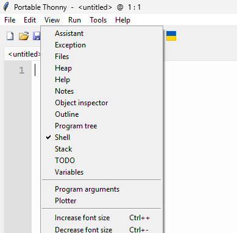
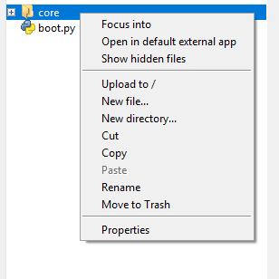

# Getting Started with PicoCore

This guide helps you set up PicoCore from scratch, flash your board, and run your first program. It assumes you are using **Raspberry Pi Pico** or **Pico W**.

---

## Installation & Setup

### 1. Download PicoCore release

- Go to the [releases](https://github.com/PauWol/PicoCore/releases) page.
- Download the latest `.zip` or `.7z` archive.
- Inside the archive you will usually find:

  - `README.md` or `instructions.txt`
  - precompiled `.mpy` libraries (the PicoCore API/runtime)
  - a matching MicroPython `.uf2` firmware file _(sometimes)_
  - some sort of **_hello world_** project in form of a `boot.py` and `main.py`

### 2. Flash MicroPython firmware

???+ "Tip: BOOTSEL mode"

    To enter bootloader mode, hold {==BOOTSEL==} on your Pico/Pico W and plug it into your PC.

1. Your board will mount as a **RPI-RP2** drive.
2. Copy the `.uf2` firmware file onto it.
      - If no `.uf2` is included in the release, check the version in the `.version` file _(highlited line)_ inside the `core` folder and download from [micropython.org](https://micropython.org/download/rp2-pico/).

        ```{ .version .no-copy title=".version" hl_lines="2"}
        2.0.0
        1.26.1
        ```

1. The board will reboot automatically and unmount.

### 3. Copy PicoCore runtime

=== "Thonny"

      1. **Open Thonny**

        !!! note "If not installed go get it on [thonny.org](https://thonny.org/)"

        <figure markdown="span">
          
          <figcaption> It should look something like this</figcaption>
        </figure>

      2. **Select Interpreter**

        - In the bottom right corner of the Thonny window, you will see the interpreter used to run the code you write in Thonny.

        - By default, Thonny uses the interpreter on the ‘Local’ computer (the one running Thonny).

        <figure markdown="span">
          
          <figcaption> Click the Python interpreter and select MicroPython.</figcaption>
        </figure>

        ??? question "Check if it worked"

            - Make sure that your Raspberry Pi Pico is connected to your computer and you have selected the MicroPython (Raspberry Pi Pico) interpreter.
            - Look at the Shell panel at the bottom of the Thonny editor.

            <figure markdown="span">
              
              <figcaption> You should see something like this.</figcaption>
            </figure>
      
      3. **Enable File View**

        <figure markdown="span">
          
          <figcaption>Click {==View==} in the top left corner and then {==Files==} in the dropdown list</figcaption>
        </figure>

      4. **Copy a folder to the device**

        <figure markdown="span">
          
          <figcaption>Right-click {==core==} and select {==Upload to /==}</figcaption>
        </figure>


=== "mpremote"

    1. **Install mpremote**
        ```bash 
        pip install mpremote
        ```
    
    2. **Check available ports**
        ```bash
        python -m mpremote connect list
        ```

    3. **Copy a folder to the device**
   
        !!! note  "`<your-port>` could be `COM13` and `<your-folder>` is usually `./core`.The `:` represents the root destination folder."
       
        ```{.py .annotate }
        python -m mpremote connect <your-port> cp -r <your-folder> : #(1)!
        ```

        1. More usage Info can be found on [pypi.org](https://pypi.org/project/mpremote/)

=== "Helper Script"

    !!! warning "Disclaimer: No helper script there yet."

### 4. Verify installation

Open a [REPL](https://en.wikipedia.org/wiki/Read%E2%80%93eval%E2%80%93print_loop) and test:

```python
import core
print(core.version())
```

✅ If you see a version string, PicoCore is working.

[Continue: First Program →](#first-program)

---

## First Program

Let’s blink the onboard LED using PicoCore APIs.

```python
from core.gpio import LED
import time

led = LED()

for i in range(5):
    led.on()
    time.sleep(0.5)
    led.off()
    time.sleep(0.5)
```

If the LED blinks five times, your setup is correct.

!!! success "Congratulations!"
You have successfully installed and tested PicoCore.

---

## Configuration

PicoCore can be customized via `config.toml`.

```toml
[system]

[system.logger]
level = "INFO"
buffersize = 5
...
```

See the [Configuration Guide](conf/v2/config.md) for details.

!!! warning "Version differences"
Different PicoCore releases may ship with slightly different `config.toml` defaults. Always check the `README` in your release archive.

---

## External Resources

- [MicroPython Documentation](https://docs.micropython.org/)
- [Thonny IDE](https://thonny.org/)
- [mpremote tool](https://docs.micropython.org/en/latest/reference/mpremote.html)
- [Raspberry Pi Pico Datasheet](https://datasheets.raspberrypi.com/pico/pico-datasheet.pdf)
- [Getting Started Guide](https://projects.raspberrypi.org/en/projects/getting-started-with-the-pico)

---

## What’s Next?

- Learn about [Services and Tasks](concepts/services.md)
- Configure PicoCore with [conf.toml](conf/overview.md)
